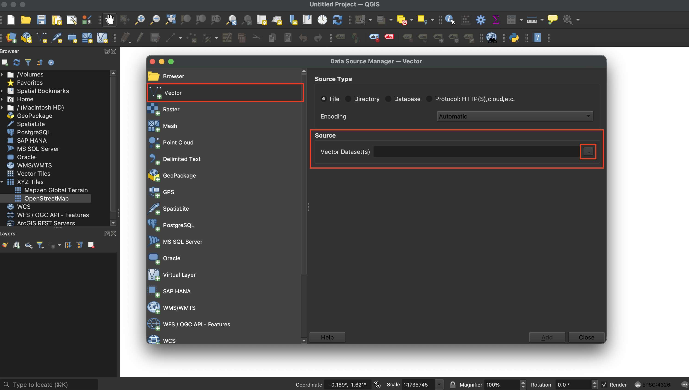
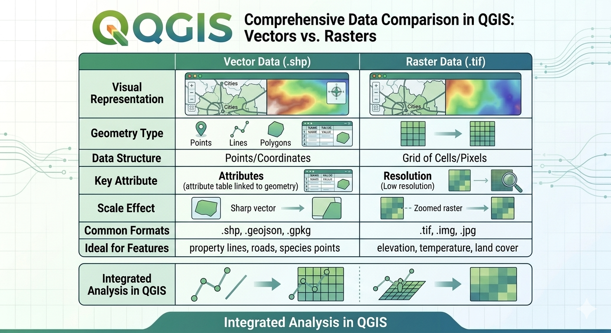

## Add some ready-made data

## Add data from local storage

There are two simple ways to add data from your computer to your QGIS project. We'll focus on vector data for now, as it's commonly used for features like points, lines, and areas on maps.

### Method 1: Drag and Drop
1. Open your computer's file explorer (Finder on Mac, File Explorer on Windows) and navigate to the data file you want to add.
2. Click and hold the file, then drag it onto the QGIS map canvas (the main map area).
3. Release the mouse button. The layer will appear in the Layers panel on the right side of the screen. The appearance may vary depending on the file type (e.g., points might show as dots, lines as paths).

### Method 2: Using the Menu
1. In the top menu bar, click **Layer** > **Add Layer** > **Add Vector Layer**.
   
2. The Data Source Manager window will open. In the **Source** section, click the three dots (...) next to the file path box to browse your computer files.
   
3. Navigate to and select the file you want to add, then click **Open**.
4. Click **Add** in the Data Source Manager to load the layer into your project. It will appear in the Layers panel.

These methods work for common formats like Shapefiles (.shp), GeoJSON (.geojson), and others. If your data doesn't load, ensure it's a supported geographic format and try again.

## Re-ordering data and creating groups

### Re-ordering Layers: The Stacking Logic
QGIS draws your map layers like stacking papers on a desk, the bottom layer is put down first, and layers on top can cover what's below. This means the order in your Layers panel matters for what you see on the map.
- How to move them: Just click and drag any layer up or down in the Layers panel to change its position.
- The Golden Rule of Stacking: To keep everything visible, arrange your layers in this order from top to bottom:
  1. Top: Points (small markers that can get hidden easily).
  2. Middle: Lines (like roads or rivers).
  3. Bottom: Polygons (areas like parks or buildings).
  4. Background: Rasters (images like satellite photos or shaded relief maps).

### Creating Groups: Bundling Your Data
Groups help organize your layers by putting them into folders, making your Layers panel less cluttered and easier to manage.
- To create a group: Right-click in the Layers panel and choose "Add Group." Then, drag layers into it like filing papers.
- Batch Visibility: Check the box next to a group name to turn all its layers on or off together. This is handy for switching between topics, like showing "Environmental Data" or "Infrastructure" separately.
- Nesting: You can put groups inside other groups for bigger projects with many layers.

### Mutually Exclusive Groups (The Radio Button Trick)
If you have several background maps (like satellite views or street maps) and only want to show one at a time you can use this trick.
1. Put the background maps into a single group.
2. Right-click the group and select Mutually Exclusive Group.
3. Now, turning one map on will automatically turn off the others in that group.

### Renaming for Clarity
Data you download often has confusing names, like "TL_2023_06_ADDR.shp." Renaming them makes your project easier to understand.
- Double-click slowly (or press F2) on a layer name in the Layers panel to edit it. Change it to something simple, like "City Addresses." This only updates the name in QGIS, it doesn't change the original file's name.

## Theory - Vectors and Rasters

### Vector vs. Raster: Key Differences
Think of your map data like two ways to draw a picture. Vector data uses precise math to show individual features, like dots for points, lines for paths, or shapes for areas. Raster data is like a digital photo—it's made of tiny colored squares (pixels) that cover a whole area smoothly.

Choose Vector when you need exact details and locations, such as for planning cities, finding directions, or mapping property boundaries.

Choose Raster for showing broad patterns across landscapes, like satellite images, elevation models, or flood prediction maps.

In most QGIS projects, you'll use both types together. For example, you could overlay vector points showing important sites on a raster satellite image to see how they fit into the landscape.

