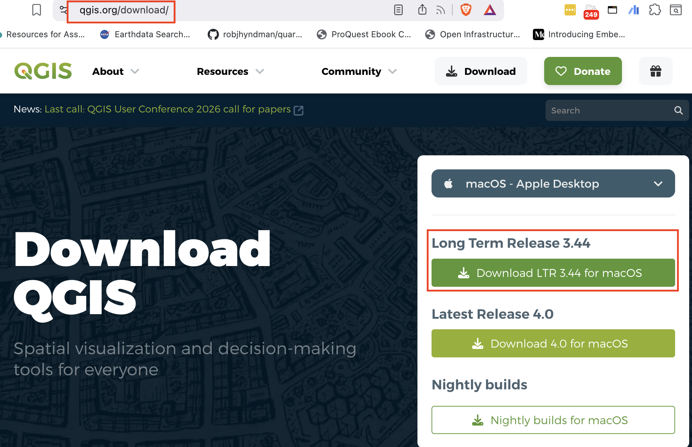

## Download and Install QGIS

QGIS is a free program for working with maps and geographic data.

1. Open your web browser and go to [qgis.org/download](https://qgis.org/download).
2. Choose the **Long Term Release** version (3.44) for your operating system.
3. Follow the on-screen instructions to download and install QGIS.

If you want more details, the official QGIS installation guide is here:
[QGIS installation guide](https://docs.qgis.org/3.44/en/docs/user_manual/introduction/getting_started.html#installing-qgis).



> Tip: If you are using a Mac, choose the Mac installer. If you are using Windows, choose the Windows installer.

When the install finishes, try opening QGIS and then close it again. This is the first step in getting comfortable with the program.

## Getting to know the QGIS window

QGIS has a lot of tools, but the first view is simple once you know the main parts.


### The main areas you will see

1. **Menu bar**: the top row of words like File, Edit, and View. It holds most of the commands.
2. **Toolbars**: buttons under the menu that give quick access to common actions.
3. **Panels**:
  - **Browser Panel**: browse files, folders and databases.
  - **Layers Panel**: manage the map layers you have loaded.
  - **Processing Toolbox**: a library of tools for working with data.
4. **Map View**: the big central area where the map appears.
5. **Status Bar**: the bottom bar that shows useful information about the map and the current view.

### Why this is useful

QGIS may look busy at first, but each part has a simple job:

- The menu and toolbars help you start actions.
- The panels help you organize files and layers.
- The map view is where you see the results.
- The status bar tells you what is happening.

Take a moment to open QGIS, look around, and notice these areas. In the next steps, we will learn how to open a map and add data in a way that feels natural.


**Feedback**
```{=html}
<iframe width="640px" height="480px" src="https://forms.office.com/Pages/ResponsePage.aspx?id=z_NbDvQft0aRdlLFOMIqTcB7gT7amOFBtQpSrGmDhYZUNDhRT1kwNVZLVkJISjhINks2S0tTRkdPMiQlQCN0PWcu&embed=true" frameborder="0" marginwidth="0" marginheight="0" style="border: none; max-width:100%; max-height:100vh" allowfullscreen webkitallowfullscreen mozallowfullscreen msallowfullscreen> </iframe>
```