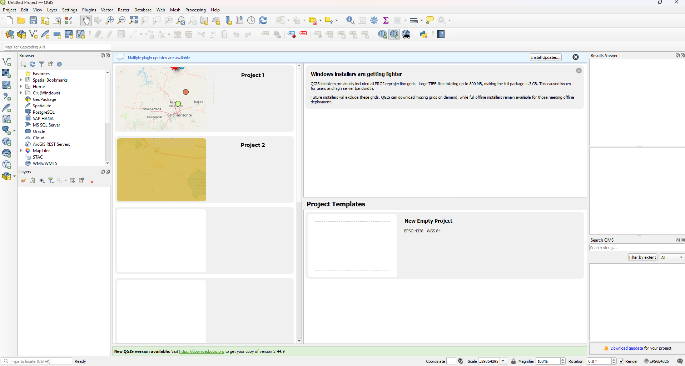
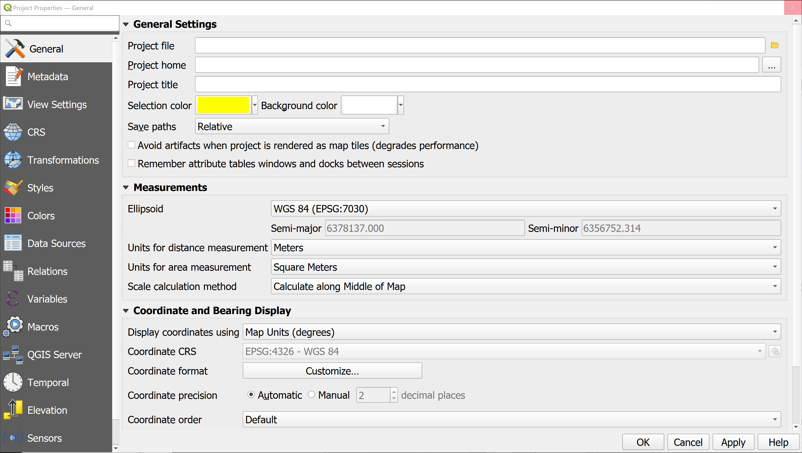

## What is a QGIS project?

A QGIS project (.qgs or .qgz) is a saved workspace file that acts as a container for your mapping session, storing layer references, styling, map layouts, and system settings

## Open a sample project

Use the Project > Open menu, double-click a .qgz or .qgs file in your file manager, or select it from the "Recent Projects" list on the home screen.

::: {.callout-tip title="Your Turn"}
Open the demo project provided for this course. The project file and data are located in the Demo_project folder. The project file is named `demo_project.qgz`. Open this file in QGIS to explore the layers and settings.
:::

## Find information about your project

### Navigate the opened project

First, we will attempt to move around the project. 

Use the Pan tool (hand icon) to click and drag the map to move it around. Use the Zoom In and Zoom Out tools (magnifying glass icons) to zoom in and out of the map. You can also use the mouse scroll wheel to zoom in and out. 

::: {.callout-tip title="Your Turn"}
1. Find an area of interest in the project. 
2. Zoom in and out. Pan around at a constant zoom level. Can you tell where you are on the map and what the zoom level is?
:::

The content of the data can be very rich, and is organised in layers. Each layer has its own content and representeation.

::: {.callout-tip title="Your Turn"}
3. What layers do you have? 
4. Can you change the order of these layers? What happens when you change the order?
5. Maybe there is too much information. Can you turn some layers on/off?
:::

### Properties of a project and its layers

There are many properties that a project can set. We will only discuss the most important ons for now:

- Units of the project ( e.g. meters, feet, degrees)
- Coordinate Reference System (CRS) of the project

**Project Properties (Ctrl+Shift+P):** Navigate to Project > Properties, and explore the General and CRS tabs.

::: {.callout-tip title="Your Turn"}
6. What is the Coordinate reference system of the project? For Wurundjeri Country use GDA2020 (Geocentric Datum of Australia 2020)/MGA Zone 55 (EPSG:7855), or /VicGrid (EPSG:7899), although older datasets may use GDA94/VicGrid (EPSG:3111).
7. What units are default for your QGIS project?
8. Can you set the title of the project? Can you set the author of the project?
:::

Layer Properties: Double-click on any layer in the Layers Panel or right-click and select Properties to view specific information about that layer.

<!-- Name, projection ,possibly author-->

## Find information about your data

Attributes Toolbar: Look for the icon with a small white "i" inside a blue circle.
Menu Bar: Navigate to View > Identify Features.
Keyboard Shortcut: Press Ctrl + Shift + I

### What are the coordinates of **this** point?

The Quick Peek (Status Bar)
As you move your mouse over the map, look at the Coordinate box in the status bar at the very bottom of the screen.
Pro Tip: If you see large numbers (e.g., 320500, 5812000), you are seeing Eastings/Northings (MGA). If you see small numbers (e.g., 144.9, -37.8), you are seeing Longitude/Latitude.

<!-- - How to find the coordinates of a point on the map (i.e. using the "Identify Features" tool) -->

### What is **here**?

Use the Identify Features tool and click the point to see its location under the "Derived" section in the results panel.

If you want coordinates for an existing object (like a specific building or property boundary):
Select the Identify Features tool (the blue "i" icon in the top toolbar).
Click on the object.
In the Identify Results panel, expand the (Derived) section. You will see coordinates for the exact point you clicked, as well as the "Centroid" (the middle) of the object.

<!-- - How to find the attributes of a feature at this point (i.e. using the "Identify Features" tool) -->

### Where is **this** feature?

Open the Attribute Table: Right-click your layer in the Layers Panel and select Open Attribute Table (or hit F6)

Check the official documentation in the QGIS  [https://docs.qgis.org/3.44/en/docs/user_manual/working_with_vector/attribute_table.html](maual).

::: {.callout-tip title="Your Turn"}
1. Where do you find a function to pan (move the map left and right, up and down?
2. How can you zoom the map? Is there a way to zoom without using the icon?
:::

<!-- - How to find the location of a feature with a given attribute value (i.e. using the "Attributes table" tool) -->

<!-- TODO: Add instructions for opening a sample project -->
<!-- - How QGIS links into live documents (i.e. warning not to move source files around or information on how to update source locations if you do need to move things).

- Metadata and crediting.--> 