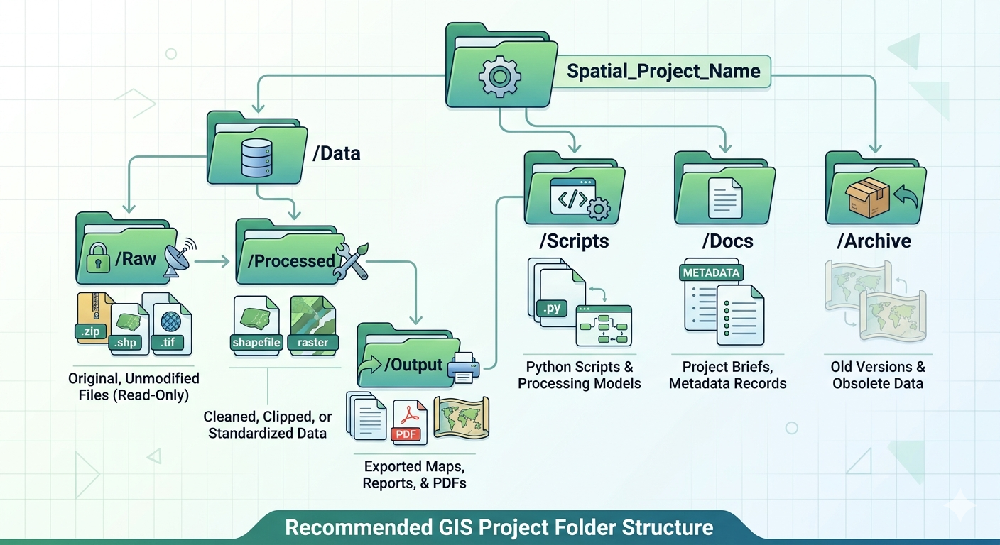
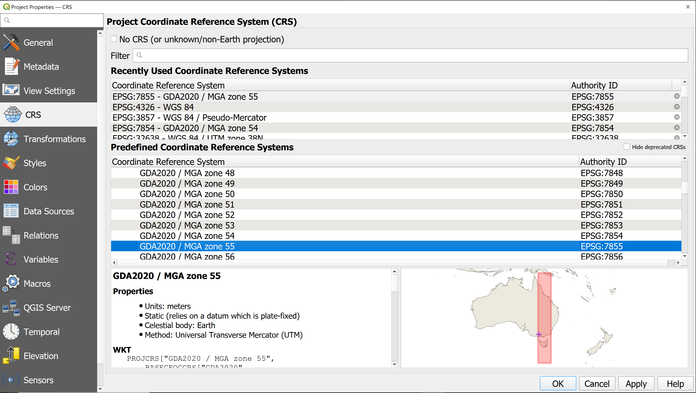
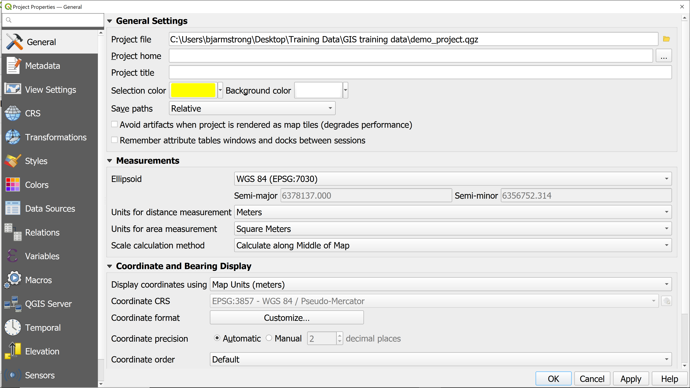
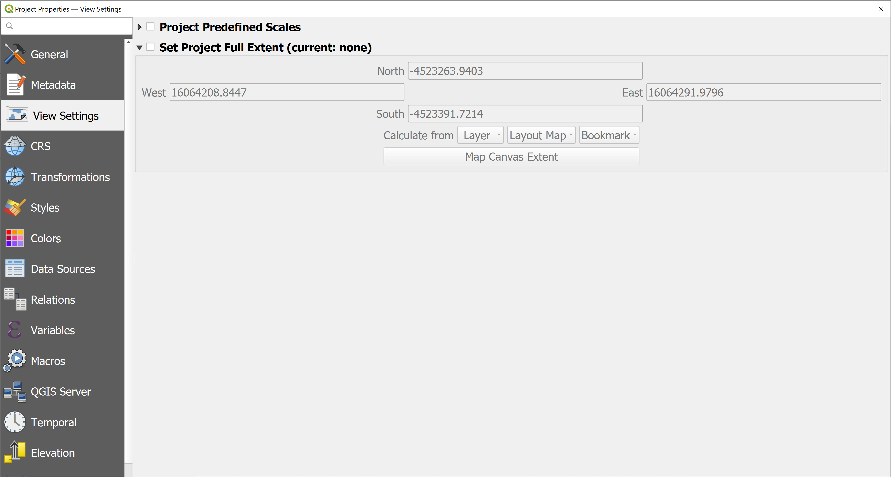
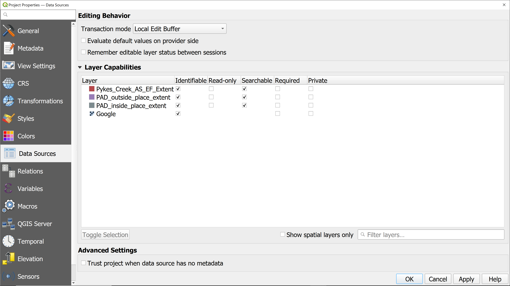
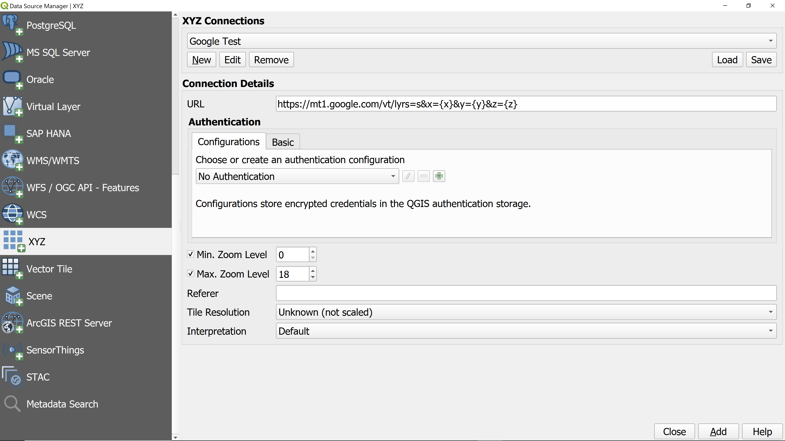
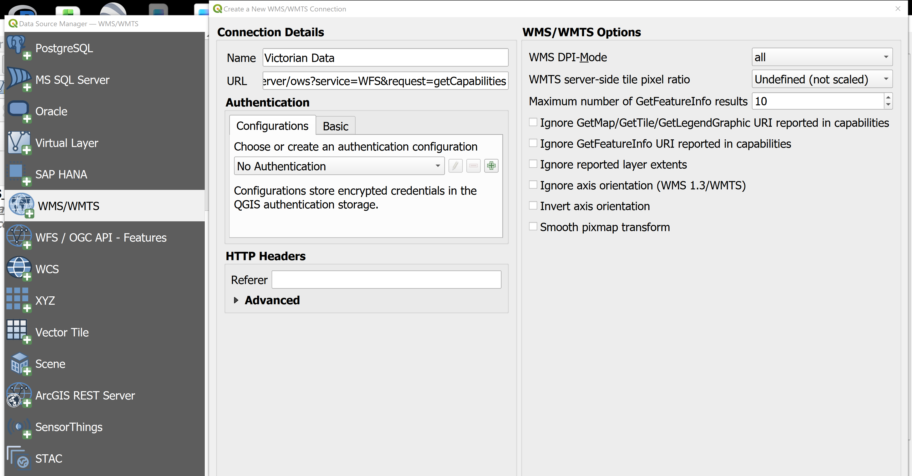

We will try to replicate the project you have just explored.

<!-- - Projections and why they matter.
In Victoria, map projections are mathematical tools used to flatten the Earth’s curved surface into a 2D map. Choosing the right one is critical because every projection introduces some level of distortion in distance, area, or shape. 
Using the wrong projection can lead to significant errors in measurement and data alignment—for example, a "gap" of roughly 1.8 metres exists between older GDA94 and modern GDA2020 datasets.
VicGrid2020 (EPSG: 7899): This is a "Lambert Conformal Conic" projection specifically designed for Victoria.
Why it matters: It is the most accurate choice for state-wide mapping. It minimises distortion across the entire state into a single zone, making it ideal for government planning and environmental analysis.
MGA2020 (Zones 54 and 55): Part of the "Map Grid of Australia," this uses a Universal Transverse Mercator (UTM) projection.
Why it matters: It is best for high-precision local work like surveying or construction. Victoria is split into two zones: Zone 54 (Western Vic) and Zone 55 (Melbourne and Eastern Vic). It keeps local measurements highly accurate but can cause "tears" if your project spans both zones.
Web Mercator (EPSG: 3857): The standard projection for Google Maps and other web platforms.
Why it matters: It is used for web-based visualisation. While convenient for browsing, it significantly distorts distance and area as you move away from the equator, so it should not be used for professional spatial analysis or surveying.
Data Alignment: If you mix data from the older GDA94 datum with the new GDA2020 datum without a proper transformation, your maps will be misaligned by about 1.5 to 1.8 metres. This could result in a fence line being placed in the middle of a road.
Accuracy in Measurement: In a projection like MGA2020, 1 metre on your screen is very close to 1 metre on the ground. In Web Mercator, that same "metre" could be significantly off depending on your latitude.
State-wide vs Local: VicGrid allows you to look at the whole state as one continuous map without "zone boundaries" causing issues, whereas MGA provides higher accuracy for a specific town or suburb.

- Where to get ready-made data from.
- Basemaps and linking XYZ Tiles / WMS Connections.
- Layer order, groups -->

## Setting up a folder and file system structure

Setting up a folder and file system in QGIS is critical because project files (.qgz or .qgs) do not contain actual spatial data; they only store references to file paths on your computer.
Recommended Project Structure:

Project Root: Name this after your project (e.g., GIS_Analysis_001/).
/Data: Store all spatial datasets here. You may further divide this into:
/Raw: Original, unmodified files.
/Processed: Cleaned or clipped data.
/Output: Store exported maps, PDFs, or final reports.
/Scripts: For any Python scripts or processing models used.

## Opening a new project
click Project in the top menu bar and select New, or click the New Project icon on the toolbar. For a fresh start, you can use the Ctrl+N (Windows/Linux) or Cmd+N (Mac) shortcut. It is recommended to immediately save the project (Project > Save).

## Setting up project properties
Setting up project properties in QGIS is essential for defining the spatial context and behavior of your map. You can access these settings by navigating to Project > Properties:

Coordinate Reference System (CRS): Navigate to the CRS tab to define how your data is projected on the map canvas.For Wurundjeri Country use GDA2020 (Geocentric Datum of Australia 2020)/MGA Zone 55 (EPSG:7855), or /VicGrid (EPSG:7899), although older datasets may use GDA94/VicGrid (EPSG:3111).

General Settings: Under the General tab, you can set the Project Title, background color, and selection color. This is also where you define the Project Home, which makes file management easier by using relative paths.

View Settings: In the View Settings tab, you can define the Project Full Extent. This allows you to quickly zoom back to your primary area of interest using the "Zoom Full" tool.

Data Sources: Use the Data Sources tab to manage how layers are handled, such as making specific layers read-only or hiding them from the legend.

KEY TIPS:
Add Favorites: In the Browser Panel, right-click a folder and select "Add as Favorite" for instant access.
Set Project Home: Go to Project > Properties > General and set the "Project Home" to your main folder. This makes it the default location for saving new layers.
Relative Paths: Ensure Project > Properties > General > Save Paths is set to "Relative". This allows the entire project folder to be moved or shared without breaking layer connections. 

## Add a basemap
There are several options to add basemaps to your project, the easiest method is to copy and paste the web addresses below into the URL connection Details:

Add a basemap via X,Y,Z Option
Google Satellite: https://mt1.google.com/vt/lyrs=s&x={x}&y={y}&z={z}
Google Maps (Roadmap): https://mt1.google.com/vt/lyrs=m&x={x}&y={y}&z={z}
Google Hybrid (Satellite + Roads): https://mt1.google.com/vt/lyrs=y&x={x}&y={y}&z={z}
Google Terrain: https://mt1.google.com/vt/lyrs=p&x={x}&y={y}&z={z}

## Add Victorian Datasets
Victorian Specific Datasets (copy and Paste link below into the URL of WMS/WMTS)

https://opendata.maps.vic.gov.au/geoserver/ows?service=WFS&request=getCapabilities

