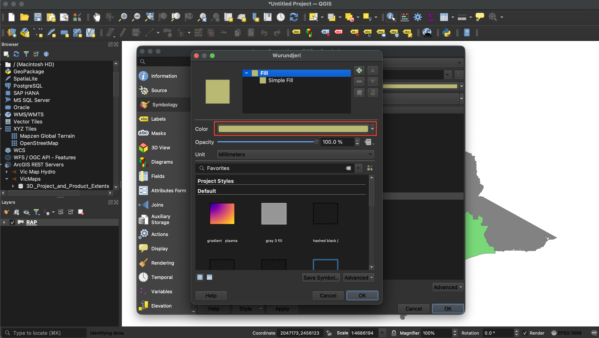
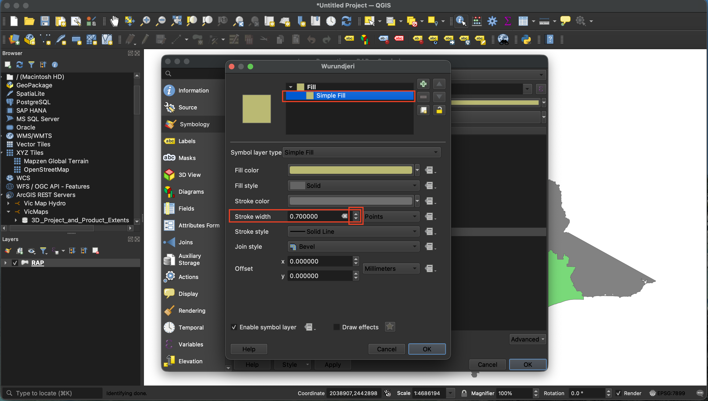
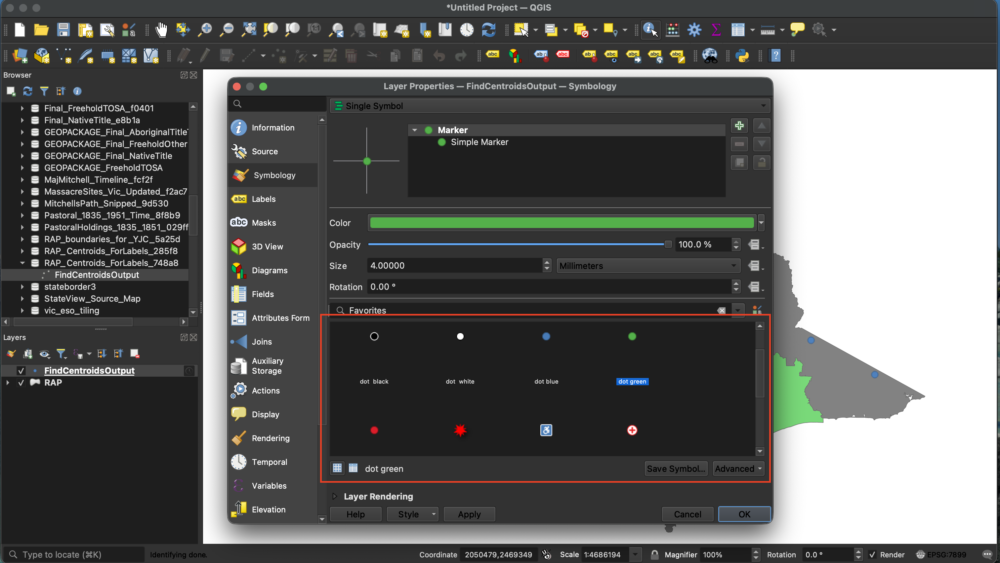
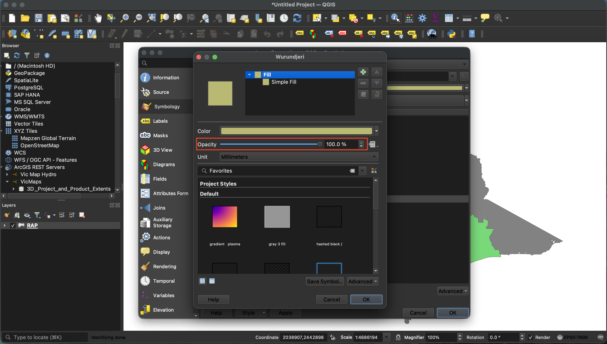

## What is cartography?

Cartography is the practice of making maps. It is a way of turning places, data and stories into a picture that is easier to understand. Good cartography helps people see what is important without needing technical knowledge.

When we style a map in QGIS, we are not changing the data itself. We are choosing how the map looks so that the message is clear. This could be especially important for your own work, where maps can support decision-making, cultural storytelling, and land management in a respectful and useful way.

For example, a map can show the same place in two different ways: one version might emphasise culturally important sites, and another version might emphasise roads, water, or local boundaries. The same information can look very different depending on the colours, symbols and line styles we choose.

## Putting lipstick on data: styling and symbology

Styling is the way we make the map easy to read and understand.

- Colour helps separate different features and draws attention to what matters most.
- Size helps show importance: bigger marks can mean more important places.
- Shape helps explain what something is: points, lines and areas can use different symbols.
- Transparency helps layers sit together without hiding each other.

Think of your map like a poster. We want the main story to stand out, while the supporting details remain visible but not distracting. In QGIS, the map is a canvas and symbology is the set of tools you use to paint it.

## How to change the symbology of a layer

To change how a layer looks in QGIS:

1. In the **Layers panel**, right-click the layer you want to style.
2. Choose **Properties**.
3. In the Layer Properties window, go to **Symbology**.
4. Choose a styling type such as **Single Symbol**, **Categorized**, or **Graduated** depending on the data.

A useful rule:

- Use **Single Symbol** when every feature should look the same.
- Use **Categorized** when the layer has different groups, like land use or site type.
- Use **Graduated** when the layer has numbers, like population or area size.

> Tip: styling only changes the appearance in QGIS. It does not alter the original data file.

### How to change the colour scheme of a layer

Colour is one of the strongest tools for telling a map story.

1. In the **Symbology** tab, click the **Colour** selection.
2. Choose a colour that is easy to see against the background.
3. For different coloured categories, choose **Categorized** at the very top of the Symbology tab, pick the field that defines the groups, then click **Classify**.
4. For numeric values, choose **Graduated** at the very top of the Symbology tab, pick a numeric field, and select a colour ramp.

Simple colour guidance:

- Use a small number of clear, distinct colours.
- Keep related features in similar colour families.
- Avoid too many bright colours at once.
- Use gentle, readable colour ramps for number-based styling.

### How to change the size of symbols on a layer

Size helps show importance or scale.

1. In the **Symbology** tab, locate the **Size** option.
2. Use the arrows to make the symbol bigger or smaller.
3. For layers with many points, lines or areas, you can automatically set size by value using **Graduated** or **Rule-based** symbology.

Examples:

- Use a larger symbol for a main cultural site and a smaller symbol for a minor site.
- Use a thicker line for a major road and a thinner line for a small track.
- Use a stronger border for an important area boundary and a lighter border for a less important one.

### How to change the shape of symbols on a layer

Different shapes can make your map easier to read.

1. In the **Symbology** tab, click the Symbol shape selector.
2. Choose simple shapes such as circle, square or triangle.
3. Optionally use **SVG Marker** to choose a custom icon.

Use shapes that feel right for the information. For example, a point for a water source can use a circle, while a cultural site might use a different symbol to stand out.

### How to change the transparency of a layer

Transparency helps layers work together without covering each other.

1. In the **Symbology** tab, find the **Opacity** slider.
2. Move the slider lower to make the layer more transparent or move the slider higher to make it more solid.
3. Use transparency when you want the map below to remain visible.

When to use transparency:

- When you want a coloured area to show the land beneath it.
- When you want several layers visible at once without the map becoming too busy.

## Good styling practice

When you present a map to colleagues or community members, keep these ideas in mind:

- Keep the design simple. Too many colours, symbols or lines can confuse the message.
- Use labels and a legend that explain symbols in everyday language.
- Choose colours that are easy to read for everyone, including being colour blind friendly.
- Group related layers with similar styles so the map feels consistent.
- Ask a colleague, community member or client what they notice first. If they notice the wrong thing, adjust the style.
