## Setting up a print layout

### Create a New Layout

Go to **Project > New Print Layout**, or press **Ctrl + P**. Name It: Enter a descriptive name for your layout. You can have multiple layouts within a single project.

### Configure Page Settings

- Access Properties: Right-click anywhere on the blank white canvas and select **Page Properties** (Alter these to suit your requirements).
- Size and Orientation: In the Item Properties panel on the right, choose standard sizes like A4 or A3, or enter custom dimensions. Set the orientation to Landscape or Portrait.

## Adding map content (BOLTSS)
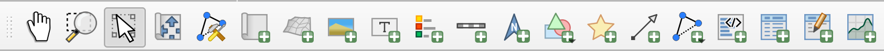

### Adding the maps 
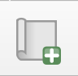
Select the Add Map icon from the toolbar
**Add Item > Add Map.**
Drawing the Frame: Click and drag on the layout canvas to define the rectangular area where your map will appear.

### Adding map *B*order

In the Item Properties panel on the right, scroll down to the Frame section. Enable the Border.
Customise Appearance: Colour, Thickness and Join Style.

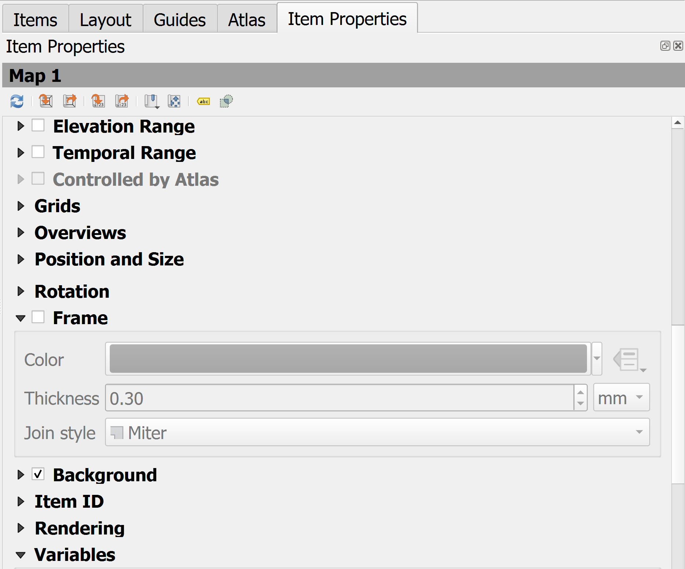

### Adding map *O*rientation (north arrow or grid) 

Select the Add North Arrow from the Toolbar.
**Add Item > Add North Arrow.**
Click and drag on the layout canvas to draw the frame where the arrow will appear. By default a simple arrow is inserted that is synced to the rotation of your main map frame.
The North Arrow can be customised in many different ways; symbols, arrows, colours, stroke, fill and custom SVGs.

### Adding *O*verview map (optional)
[YouTube Guide](https://www.youtube.com/watch?v=Q0Z1I0wHFA0)

1. Ensure your primary map (e.g., "Map 0") is correctly positioned and scaled. Add Secondary Map: Use the Add Map tool to draw a smaller box, often in a corner, for your overview.
Adjust Overview Scale: Use the Move Item Content tool or manually change the Scale in the Item Properties panel so this second map shows a much larger area (e.g., the whole country or region).

2. Select the Overview Map: Click on the small map frame you just created. Locate "Overviews". In its Item Properties panel, scroll down and expand the Overviews section.
Add New Overview: Click the green plus (+) button to add "Overview 1". In the Map frame dropdown menu, select your primary detailed map (usually Map 0 or Map 1). A coloured rectangle (the extent indicator) will now appear on the overview map, representing the area shown in your main map.

3. Customise the Indicator
Click on Frame style to change the fill colour, outline thickness, or transparency of the extent rectangle. Many cartographers use a transparent fill with a bold red stroke for visibility. Center on Overview: Check this box if you want the overview map to automatically re-center itself whenever you move the main map.

4. Lock Main Map: Select your primary map and check Lock layers and Lock styles for layers in the Main Properties.
Lock Overview: Repeat this for the overview map. This allows you to have different symbols (like simplified boundaries) on the overview without affecting the detailed main map.

### Adding map *L*egend 
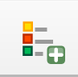
Select the Add Legend from the Toolbar. Drag on to the canvas to place it.
**Add Item > Add Legend.**
In the Item Properties panel (right side), uncheck Auto update to place into manual mode editing.
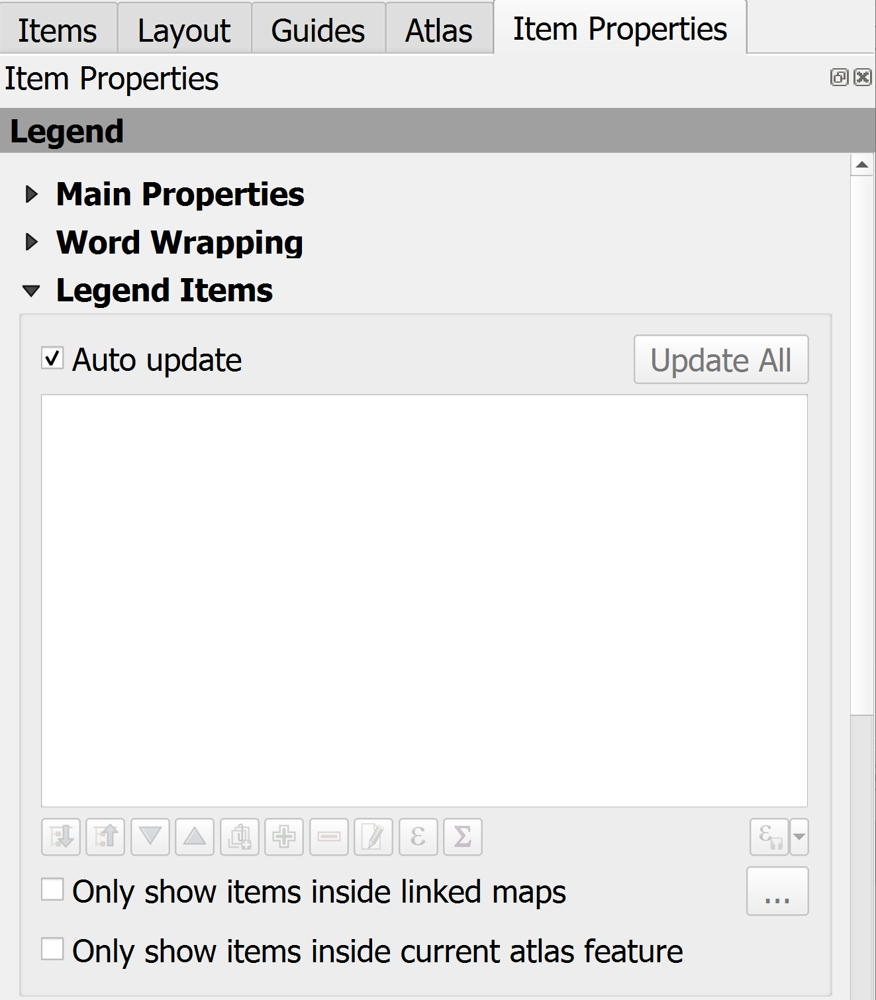
In the Item Properties panel, there are options for customisation. 

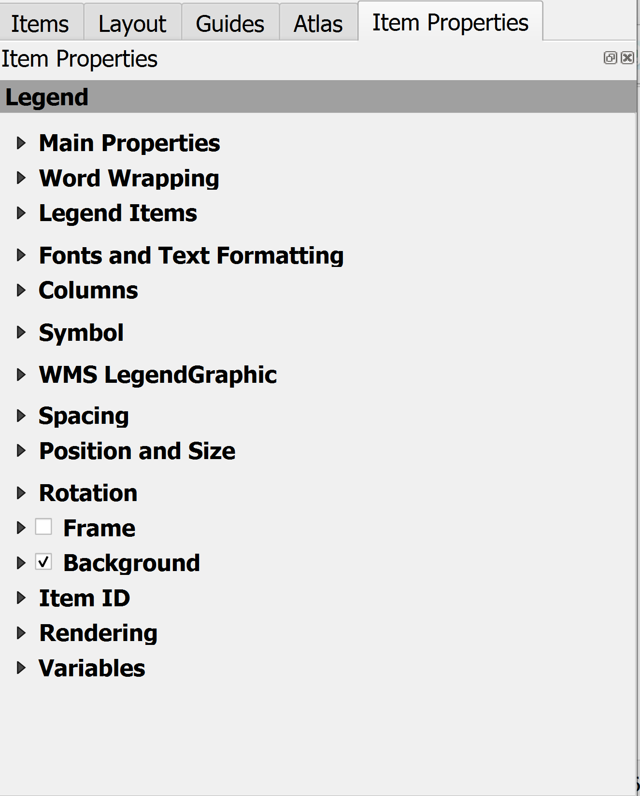
Useful properties to change:

1. Renaming Items: Double-click an layer within the legend items, or click the Edit button, to change its name. Tidying up layer names.

2. Use the plus (+) or minus (-) buttons to add or remove layers from the legend. Some layers are not needed.

3. Filter by Map: Check Only show items inside the linked map to display only active map features.

4. Fonts and Text Formatting: Change fonts for the Title, Group, or Item labels.

### Adding *T*ext and other annotations (*S*ources)
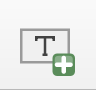
Add Label button in the toolbar and click/drag on the canvas to place it.
**Add Item > Add Label.**

1. You can replace the default "Lorem Ipsum" text with your own title or descriptive text.

2. Formatting: Customise fonts, size, and alignment under the Appearance section of Item Properties. You can also add frames, background colours and margins.

3. Dynamic Text: Insert variables or expressions for automated content, such as Current date or project title. 

You can create Annotation Layers that stay with your project rather than being tied to a specific layout.

### Adding a *S*cale bar 
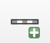
Click Add Scale Bar icon to the print layout and drag on the layout canvas.
**Add Item > Add Scale Bar.**

1. In the Item Properties panel, ensure the scale bar is linked to the correct map (e.g., "Map 1"). This creates a dynamic link so the scale updates automatically if you zoom or pan.

2. Accuracy Check: Ensure your project's Coordinate Reference System (CRS) is in a projected unit (like meters/feet) rather than degrees to ensure distance measurements are accurate.

Main Customisation:

1. Style: Choose from styles like Single Box, Double Box, Line Ticks (Up, Down, or Middle), Stepped Line, Hollow, or Numeric (e.g., 1:50,000).

2. Units: Set the display units to Meters, Kilometres, Feet, Miles, or Nautical Miles.

3. Display/Appearance: Customise the colours for fill and stroke, adjust the line width, and change the font or size of the labels.

4. Background/Frame: Add a background colour (like white with some opacity) to help the scale bar stand out against detailed map areas.

## Tricks: Using map themes

### Install the map themes plugin

Plugins are useful for all sorts of analysis and tasks.
They can be installed at any time by Opening the Plugin Manager. 

1. Go to the top menu bar and select Plugins > Manage and Install Plugins.

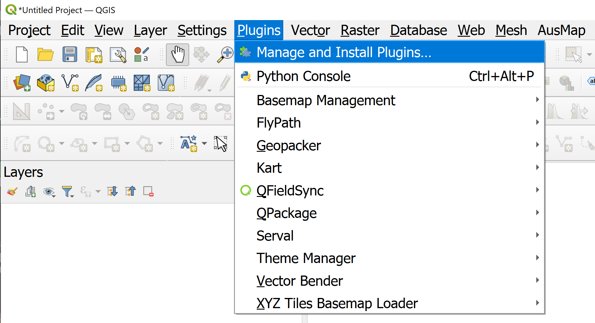

2. Find Your Plugin:Click on the All tab to see every available plugin or the Not installed tab to see new options. Use the Search bar at the top to type the name of a specific tool, such as "Theme Manager".

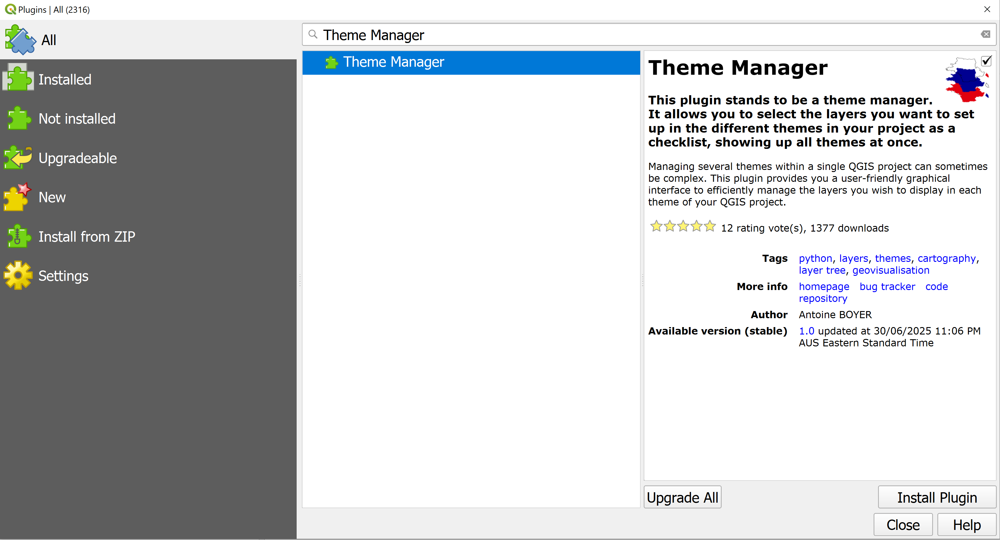

3. Install: Select the plugin from the list and click the Install Plugin button at the bottom right.

4. Once installed, plugins usually appear in one of three places; The Plugins menu, a specific relevant menu (e.g., "Web", "Vector", or "Raster") or a new Toolbar icon added to your main interface.

### Create map themes for different map content

You can link different map frames in a single layout to different themes. For example, your main map can follow a "Detailed" theme while a small locator map follows a "Simple" theme.

### Re-style your Overview map using a different map theme

1. Set Up the Overview Style: In your main Layers panel, turn on only the layers you want to see in the overview (e.g., a simple base map and your study area outline).Save the New Theme.

2. Click the Manage Map Themes icon (eye icon) at the top of the Layers panel.Select Add Theme... and name it (e.g., "Overview_Style").

3. Apply to Overview Map: Open your Print Layout and select the map item acting as your overview.In the Item Properties panel, scroll to the Layers section.Tick Follow map theme and select "Overview_Style" from the dropdown menu.

## Exporting a map for printing

Print Layouts can be printed directly or exported using the Layout> Export As Image or alternatively 3 buttons in the toolbar can bu used.
Print layouts can be exported as PDF, SVG, or images (PNG, JPG).
Set the required resolution and image size.

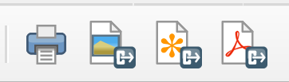

