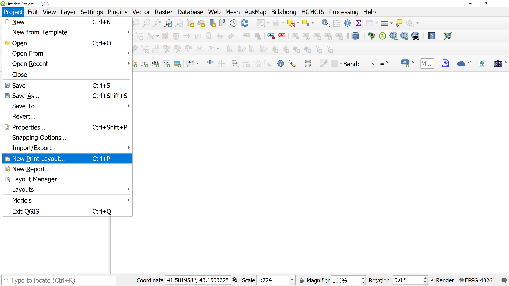
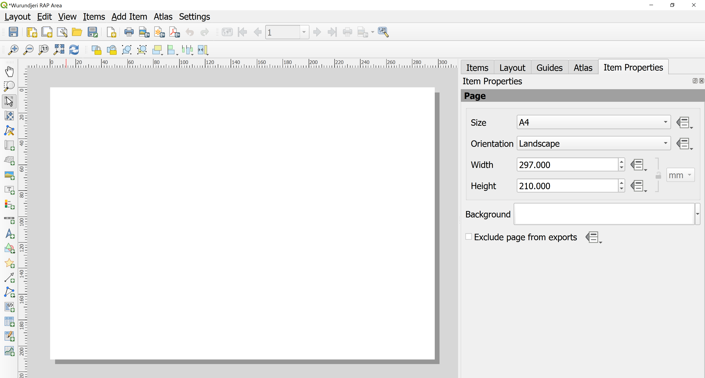

## Setting up a print layout

Create a New Layout

Go to Project > New Print Layout... or press Ctrl + P.Name It: Enter a descriptive name for your layout. You can have multiple layouts within a single project.

Configure Page Settings

Access Properties: Right-click anywhere on the blank white canvas and select Page Properties (Alter these to suit your requirements).

Size and Orientation: In the Item Properties panel on the right, choose standard sizes like A4 or A3, or enter custom dimensions. Set the orientation to Landscape or Portrait.

## Adding map content (BOLTSS)

### Adding the maps

### Adding map *B*order

### Adding map *O*rientation (north arrow or grid)

### Adding *O*verview map (optional)

### Adding map *L*egend

### Adding *T*ext and other annotations (*S*ources)

### Adding a *S*cale bar

## Tricks: Using map themes

### Install the map themes plugin

### Create map themes for different map content

### Re-style your Overview map using a different map theme

## Exporting a map for printing